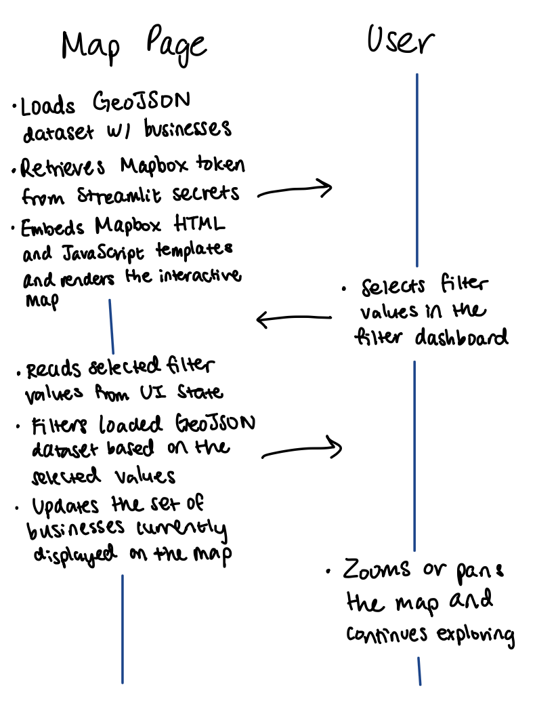
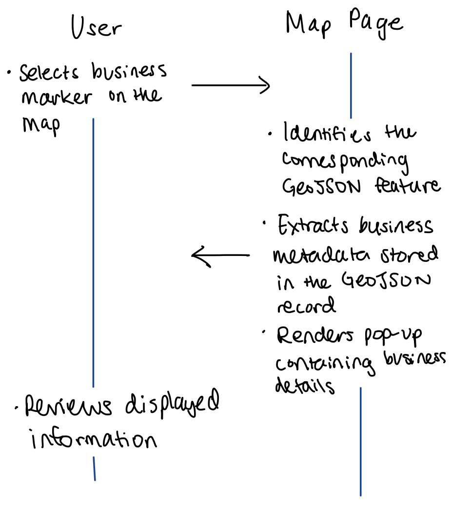
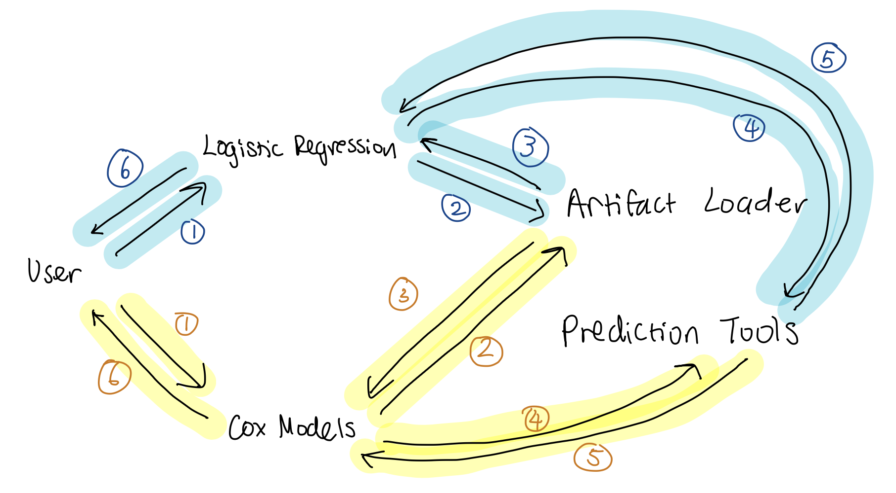
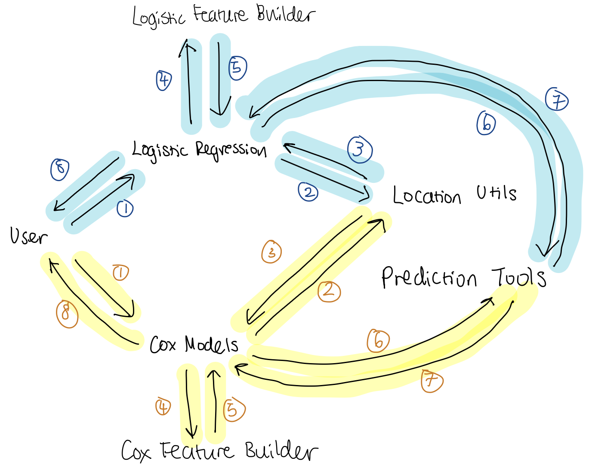
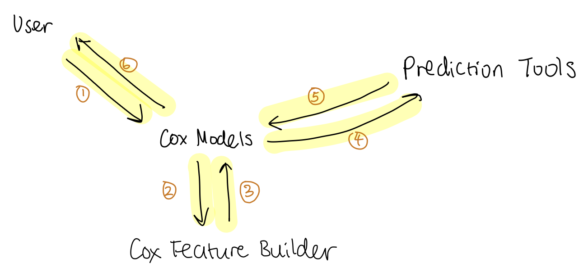

# Component Specification (Streamlit application)

## Software Components

### 1. Artifact Loader (`utils/artifact_loader.py`)

* **What it does:**
  The Artifact Loader is the system’s main interface to the trained model artifacts and reference datasets stored in the repository. It retrieves, deserializes, and caches the files needed by the Streamlit app so that the application does not repeatedly read large files.

  It supports loading:

  * the trained **logistic regression pipeline**,
  * the trained **standard Cox proportional hazards model**,
  * the trained **time-varying Cox model**,
  * feature metadata such as kept/dropped columns,
  * coefficient summary tables,
  * evaluation metrics,
  * reference datasets used for simulation and baseline construction.

  By centralizing artifact access, the rest of the application can work with clean Python objects rather than raw `.pkl`, `.csv`, or `.json` files.

* **Inputs (with type information):**

  * `path: Path` — filesystem location of an artifact file
  * internal model directory constants such as
    `LOGISTIC_DIR: Path`, `COX_STANDARD_DIR: Path`, `COX_TIME_VARYING_DIR: Path`

* **Outputs (with type information):**

  * `artifactDict: dict[str, Any]` — dictionary containing model objects and metadata, such as
    `{ pipeline, model, scaler, kept_columns, dropped_columns, summary, metrics }`
  * `referenceData: dict[str, pandas.DataFrame]` — dictionary containing reference tables, such as
    `{ businesses, x_train, x_test }`

* **Assumptions:**
  Artifact files already exist in the `artifacts/` directory and were generated by the training pipeline using compatible library versions. Missing files raise explicit errors. Streamlit caching is used so repeated page visits do not trigger repeated disk I/O.

---

### 2. Logistic Feature Builder (`feature_builder.py`)

* **What it does:**
  The Logistic Feature Builder converts user-entered business inputs into a **single-row feature vector** compatible with the trained logistic regression model. It acts as the translation layer between the Streamlit UI and the model’s encoded feature space.

  It supports:

  * mapping display labels to encoded business category columns,
  * mapping display labels to encoded complaint feature columns,
  * building a zero-initialized profile,
  * filling in category indicators, complaint counts, license counts, and coordinates,
  * assigning the nearest learned location cluster to the selected coordinates,
  * constructing a default baseline business profile for comparison.

* **Inputs (with type information):**

  * `kept_columns: list[str]` — feature columns retained during model training
  * `reference_df: pandas.DataFrame` — reference dataset used for medians and cluster lookup
  * `inputs: BusinessProfileInputs` — structured user input object containing
    `{ selected_category_columns: list[str], active_license_count: int, business_latitude: float, business_longitude: float, complaint_counts: dict[str, float] }`

* **Outputs (with type information):**

  * `profile_df: pandas.DataFrame` — one-row model-ready feature matrix matching the logistic model schema
  * `categoryMap: dict[str, str]` — maps display category names to raw encoded feature columns
  * `complaintMap: dict[str, str]` — maps display complaint names to raw encoded feature columns

* **Assumptions:**
  The logistic model expects a fixed feature schema. Any feature not specified by the user is initialized to zero. Coordinates are assumed to represent a location within NYC bounds or are clamped into that range before model use.

---

### 3. Cox Feature Builder (`cox_feature_builder.py`)

* **What it does:**
  The Cox Feature Builder constructs model-ready inputs for both the **standard Cox model** and the **time-varying Cox model**.

  For the standard Cox model, it:

  * builds a baseline business profile,
  * converts one hypothetical business into a single-row Cox feature vector.

  For the time-varying Cox model, it:

  * builds multiple feature rows across time,
  * generates synthetic example business timelines,
  * mutates categories, complaints, license counts, and locations over time,
  * summarizes generated timelines for display in the Streamlit interface.

  This module is the main bridge between user-facing business simulation and survival-analysis feature construction.

* **Inputs (with type information):**

  * `kept_columns: list[str]` — retained Cox model feature columns
  * `reference_df: pandas.DataFrame` — reference dataset used for cluster and location lookup
  * `inputs: CoxProfileInputs` — structured Cox input object containing
    `{ selected_category_columns: list[str], active_license_count: int, business_latitude: float, business_longitude: float, complaint_counts: dict[str, float] | None }`
  * `timepoint_specs: list[dict[str, Any]]` — time-indexed records for time-varying profile generation
  * `num_businesses: int` — number of synthetic businesses to generate
  * `num_timepoints: int` — number of time points per synthetic business
  * `random_state: int` — seed for reproducible timeline generation

* **Outputs (with type information):**

  * `profile_df: pandas.DataFrame` — one-row standard Cox feature matrix
  * `profiles_df: pandas.DataFrame` — multi-row time-varying Cox feature matrix with time column(s)
  * `generatedTimelines: list[dict[str, Any]]` — synthetic business histories for the time-varying simulator
  * `timelineSummary: pandas.DataFrame` — readable table summarizing generated time-varying states

* **Assumptions:**
  The Cox models rely on the same encoded feature naming conventions used during training. Synthetic timelines are not real businesses; they are generated examples intended to demonstrate how time-varying risk changes under evolving business conditions.

---

### 4. Location Utilities (`location_utils.py`)

* **What it does:**
  The Location Utilities module handles all shared geographic and cluster-based operations used across the application.

  It supports:

  * clamping latitude/longitude values to the NYC study area,
  * extracting unique location-cluster centroids from a reference dataset,
  * assigning the nearest cluster centroid to a selected location,
  * defining shared geographic constants such as latitude and longitude bounds.

  This module enables the logistic and Cox feature builders to assign spatial context consistently.

* **Inputs (with type information):**

  * `latitude: float`
  * `longitude: float`
  * `reference_df: pandas.DataFrame`
  * `lat_column: str`
  * `lng_column: str`
  * `cluster_column: str`

* **Outputs (with type information):**

  * `clampedCoordinates: tuple[float, float]` — latitude/longitude pair restricted to NYC bounds
  * `cluster_df: pandas.DataFrame` — unique location-cluster centroid table
  * `clusterInfo: tuple[float | None, float, float]` — nearest cluster ID and centroid coordinates

* **Assumptions:**
  Spatial calculations are approximate and intended for neighborhood-level modeling, not parcel-level geospatial analysis. If cluster metadata is unavailable, the utilities fall back to the user’s selected coordinates.

---

### 5. Prediction Tools (`prediction_tools.py`)

* **What it does:**
  The Prediction Tools module provides the app’s direct interface to trained model inference. It takes model-ready feature data and produces user-facing predictions and summaries.

  It supports:

  * logistic regression classification and probability prediction,
  * standard Cox partial hazard prediction,
  * standard Cox survival probability prediction at selected time horizons,
  * time-varying Cox partial hazard prediction across multiple rows,
  * extraction of top positive and negative coefficients from model summary tables.

  This component allows the Streamlit pages to remain focused on UI logic while prediction logic is handled in one place.

* **Inputs (with type information):**

  * `pipeline: Any` — trained sklearn logistic pipeline
  * `model: Any` — trained Cox model object
  * `scaler: Any` — fitted scaler associated with a Cox model
  * `kept_columns: list[str]` — feature columns expected by the model
  * `profile_df: pandas.DataFrame` — one-row model input
  * `profiles_df: pandas.DataFrame` — multi-row model input for time-varying prediction
  * `summary_df: pandas.DataFrame` — coefficient summary table
  * `coefficient_col: str` — column containing coefficient values
  * `survival_times: list[int] (optional)` — months at which survival probabilities should be evaluated

* **Outputs (with type information):**

  * `prediction: dict[str, float | int]` — for logistic regression, e.g.
    `{ predicted_survival_probability: float, predicted_class: int }`
  * `coxPrediction: dict[str, float]` — for standard Cox, e.g.
    `{ partial_hazard: float, survival_prob_12m: float, survival_prob_36m: float, ... }`
  * `predictionTable: pandas.DataFrame` — time-varying risk predictions for multiple rows
  * `topPositive: pandas.DataFrame`
  * `topNegative: pandas.DataFrame`

* **Assumptions:**
  The input profile schema must exactly match the schema expected by the trained model. If the saved sklearn pipeline is incompatible with the current environment, the module raises a runtime error with an explanatory message.

---

### 6. Map Page (`Business Landscape Explorer`)

* **What it does:**
  The Map page is the application’s spatial exploration interface. It renders businesses across New York City using a Mapbox-based visualization embedded inside Streamlit.

  It supports:

  * loading precomputed GeoJSON business data,
  * rendering an interactive map,
  * displaying business metadata through map popups,
  * directing users to the model simulation pages for survival estimation.

  The page acts primarily as a visualization component rather than a model inference component.

* **Inputs (with type information):**

  * `GEOJSON_PATH: Path` — path to the precomputed GeoJSON file
  * `MAPBOX_PUBLIC_TOKEN: string` — Mapbox token stored in Streamlit secrets
  * `index_html: string` — HTML template for the map
  * `app_js: string` — JavaScript logic for the embedded map

* **Outputs (with type information):**

  * `renderedMap: Streamlit UI component` — interactive business map embedded in the page
  * `popupContent: HTML/JS-rendered business metadata` — shown when a business marker is selected

* **Assumptions:**
  GeoJSON has already been generated by the preprocessing and geojson pipeline. Map rendering depends on a valid Mapbox public token. If the token or GeoJSON file is missing, the page stops and shows an explicit error.

---

### 7. Logistic Regression Page (`Logistic Regression`)

* **What it does:**
  The Logistic Regression page allows users to define a hypothetical business and estimate its probability of surviving at least **36 months**.

  It supports:

  * selecting business categories,
  * selecting complaint types and entering counts,
  * specifying average active license count,
  * specifying business latitude and longitude,
  * generating a hypothetical logistic feature profile,
  * computing a prediction and comparing it with a baseline business.

  In addition, it includes a model-inspection tab that displays:

  * top positive and negative coefficients,
  * class-specific performance metrics,
  * average predicted probabilities by true outcome,
  * dataset sizes for reference.

* **Inputs (with type information):**

  * user-selected categories: `list[str]`
  * user-selected complaints: `list[str]`
  * complaint counts: `dict[str, float]`
  * `active_license_count: int`
  * `business_latitude: float`
  * `business_longitude: float`
  * loaded logistic artifacts and reference datasets

* **Outputs (with type information):**

  * `predictionOutput: dict[str, float | int]` — predicted probability and class
  * `resultsTable: pandas.DataFrame` — baseline vs. hypothetical comparison
  * `featureTable: pandas.DataFrame` — nonzero entered/derived features used in prediction
  * `coefficientTables: pandas.DataFrame / styled table`
  * `evaluationTables: pandas.DataFrame`

* **Assumptions:**
  This page predicts 3-year survival using features summarized from the first 12 months of a business profile. It is intended as a simulation and interpretation tool, not as a definitive forecast of real-world success.

---

### 8. Cox Models Page (`Cox Models`)

* **What it does:**
  The Cox Models page provides two survival-analysis interfaces: one for a **standard Cox model** and one for a **time-varying Cox model**.

  The **standard Cox tab** supports:

  * comparing multiple hypothetical businesses,
  * predicting 1-, 3-, 5-, and 10-year survival probabilities,
  * comparing partial hazard and relative risk vs. a baseline business,
  * displaying top hazard-increasing and hazard-decreasing features.

  The **time-varying Cox tab** supports:

  * generating synthetic business timelines,
  * predicting partial hazard at each time point,
  * plotting risk across time,
  * summarizing generated business states and risk scores,
  * displaying top hazard-increasing and hazard-decreasing features.

* **Inputs (with type information):**

  * standard Cox business specs: `list[dict[str, object]]`
  * time-varying timeline specs: `list[dict[str, Any]]`
  * `num_businesses: int`
  * `num_timepoints: int`
  * standard/time-varying Cox artifacts and reference datasets

* **Outputs (with type information):**

  * `survivalTrajectoryTable: pandas.DataFrame`
  * `riskSummaryTable: pandas.DataFrame`
  * `riskChart: Streamlit line chart`
  * `generatedTimelineTable: pandas.DataFrame`
  * `coefficientTables: pandas.DataFrame / styled table`

* **Assumptions:**
  The standard Cox model uses baseline business characteristics only and assumes their effects remain constant over time. The time-varying Cox model reflects changing business conditions over time but does not directly produce long-term survival curves in the same way as the standard Cox model.

---

### 9. Findings Page (`Findings`)

* **What it does:**
  The Findings page is the application’s interpretation and documentation interface. It summarizes what the trained models suggest, explains the datasets, and provides project context.

  It includes:

  * a discussion of logistic regression results,
  * a comparison between logistic regression and both Cox models,
  * an overall conclusion,
  * a description of the two NYC Open Data datasets used,
  * a discussion of join logic and dataset caveats,
  * authorship and repository information.

  This page helps users understand what the models mean and how the system was built.

* **Inputs (with type information):**

  * static explanatory text
  * dataset links: `string`
  * repository and author metadata: `string`

* **Outputs (with type information):**

  * `discussionView: Streamlit tabbed interface`
  * `datasetSummaryView: Streamlit content blocks`
  * `aboutView: Streamlit content blocks`

* **Assumptions:**
  This page is descriptive rather than computational. It does not run predictions, but it depends on the rest of the application’s outputs being conceptually consistent with the explanations presented.

---

# Interactions to Accomplish Use Cases

> Components used:
>
> * **Artifact Loader (`artifact_loader.py`)** – loads trained models, metadata, metrics, and reference datasets.
> * **Logistic Feature Builder (`feature_builder.py`)** – constructs logistic regression feature vectors from user inputs.
> * **Cox Feature Builder (`cox_feature_builder.py`)** – constructs feature vectors for standard and time-varying Cox models.
> * **Location Utilities (`location_utils.py`)** – handles coordinate validation and location cluster assignment.
> * **Prediction Tools (`prediction_tools.py`)** – performs model inference and extracts model insights.
> * **Map Page (`Business Landscape Explorer`)** – displays spatial business data using Mapbox.
> * **Logistic Regression Page (`Logistic Regression`)** – allows users to simulate hypothetical businesses using the logistic model.
> * **Cox Models Page (`Cox Models`)** – allows users to simulate business survival using standard and time-varying Cox models.

---

# Use Case 1: User explores businesses on the map using filters

## Interaction Flow

1. The **Map Page (`Business Landscape Explorer`)** loads the GeoJSON dataset containing business locations.
2. **Map Page (`Business Landscape Explorer`)** retrieves the Mapbox token from Streamlit secrets.
3. **Map Page (`Business Landscape Explorer`)** embeds the Mapbox HTML and JavaScript templates and renders the interactive map.
4. The **User** selects filter values in the filter dashboard (for example category, borough, or business status).
5. **Map Page (`Business Landscape Explorer`)** reads the selected filter values from the Streamlit UI state.
6. **Map Page (`Business Landscape Explorer`)** filters the loaded GeoJSON dataset based on the selected values.
7. **Map Page (`Business Landscape Explorer`)** updates the set of businesses currently displayed on the map.
8. The **User** zooms or pans the map and continues exploring the filtered business results.

---

## Interaction Diagram

---

# Use Case 2: User inspects a business on the map

### Interaction Flow

1. The **User** selects a business marker on the **Map Page (`Business Landscape Explorer`)**.
2. **Map Page (`Business Landscape Explorer`)** identifies the corresponding GeoJSON feature.
3. **Map Page (`Business Landscape Explorer`)** extracts business metadata stored in the GeoJSON record.
4. **Map Page (`Business Landscape Explorer`)** renders the popup containing business details.
5. The **User** reviews the displayed business information.

### Interaction Diagram

---

# Use Case 3: User explores model insights

### Interaction Flow

1. The **User** opens the **Logistic Regression Page (`Logistic Regression`)** or the **Cox Models Page (`Cox Models`)**.
2. The selected page calls **Artifact Loader (`artifact_loader.py`)** to load model summaries and evaluation metrics.
3. The page sends the summary tables to **Prediction Tools (`prediction_tools.py`)**.
4. **Prediction Tools (`prediction_tools.py`)** extracts top positive and negative coefficients from the model summaries.
5. The page displays styled tables showing influential features.
6. The **User** interprets which business features increase or decrease survival risk.

### Interaction Diagram

---

# Use Case 4: User evaluates a hypothetical business location

### Interaction Flow

1. The **User** enters hypothetical business inputs on the **Logistic Regression Page (`Logistic Regression`)** or **Standard Cox Models Page (`Cox Models`)**.
2. The page sends the entered coordinates to **Location Utilities (`location_utils.py`)**.
3. **Location Utilities (`location_utils.py`)** clamps the coordinates to NYC bounds and assigns the nearest location cluster.
4. The page sends user inputs to:

   * **Logistic Feature Builder (`feature_builder.py`)**, or
   * **Cox Feature Builder (`cox_feature_builder.py`)**.
5. The selected feature builder constructs a model-ready feature vector.
6. The page sends the feature vector to **Prediction Tools (`prediction_tools.py`)**.
7. **Prediction Tools (`prediction_tools.py`)** performs model inference using the trained model loaded by **Artifact Loader (`artifact_loader.py`)**.
8. **Prediction Tools (`prediction_tools.py`)** returns predicted survival probability or hazard score.
9. The page displays:

   * graphical outputs (charts or visual indicators),
   * numerical outputs (survival probability or hazard score),
   * comparison with the baseline business.
10. The **User** reviews the simulation results.

### Interaction Diagram

---

# Use Case 5: User explores changing business risk over time

### Interaction Flow

1. The **User** opens the **Cox Models Page (`Cox Models`)** and selects the **time-varying Cox tab**.
2. The **Cox Models Page (`Cox Models`)** sends simulation parameters to **Cox Feature Builder (`cox_feature_builder.py`)**.
3. **Cox Feature Builder (`cox_feature_builder.py`)** generates synthetic business timelines.
4. **Cox Feature Builder (`cox_feature_builder.py`)** converts the timelines into time-varying feature matrices.
5. The **Cox Models Page (`Cox Models`)** sends these features to **Prediction Tools (`prediction_tools.py`)**.
6. **Prediction Tools (`prediction_tools.py`)** computes partial hazard scores for each time point.
7. The **Cox Models Page (`Cox Models`)** renders risk trajectories as charts and summary tables.
8. The **User** compares how business risk evolves over time.

### Interaction Diagram

